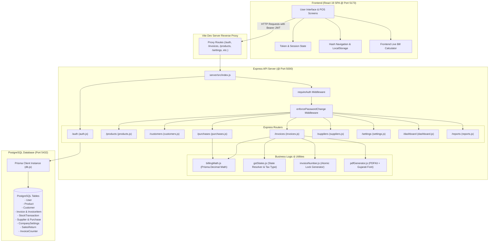
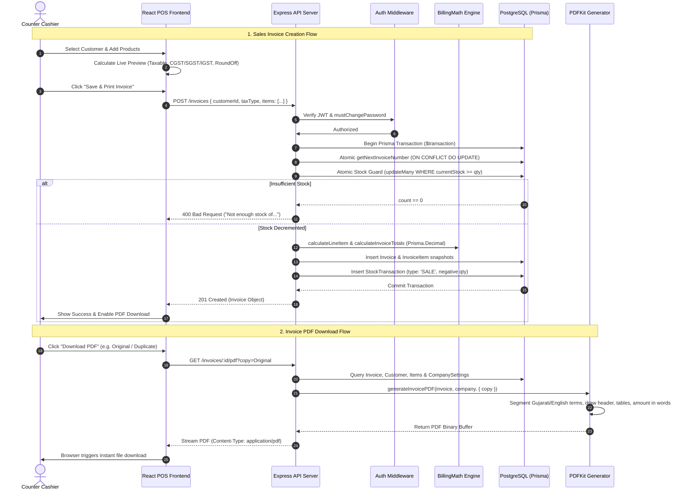
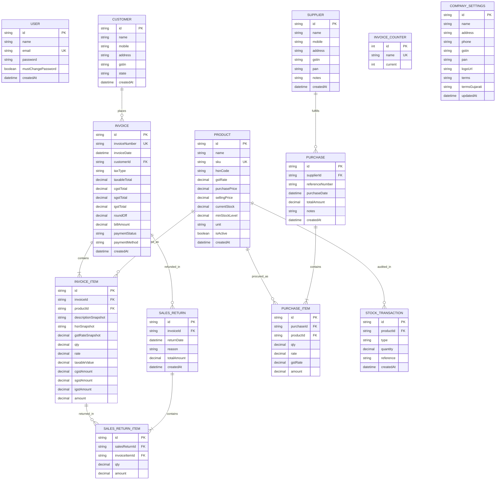

# Codebase Documentation: Prathna Billing & Inventory Management System

> **Document Version:** 1.1.0  
> **Audit Date:** September 2026  
> **Author:** Senior Software Architect & Codebase Auditor  
> **System Architecture:** PERN (PostgreSQL, Express, React, Node.js) with Prisma ORM & Vite  
> **Status:** Feature-Complete & Backend-Verified (40/40 Automated Tests Passing) — Pending Human Manual E2E Walkthrough & Physical Device Verification

---

## 1. Executive Summary

The **Prathna Billing & Inventory Management System** is a full-stack Point of Sale (POS), GST invoicing, purchase tracking, and inventory control application tailored for retail and wholesale counter operations (specifically designed and customized for **Prathna Enterprises**, Gujarat, India).

### Key Architectural Strengths
1. **Financial Precision:** Strict `Prisma.Decimal` (arbitrary-precision decimal arithmetic) used end-to-end across line-item calculation, 50/50 intra-state CGST/SGST tax splitting, inter-state 100% IGST computation, and rupee rounding. Zero JavaScript binary floating-point errors (`0.1 + 0.2 !== 0.3`).
2. **Concurrency Safety:**
   - Atomic invoice generation with PostgreSQL row-level locks on `InvoiceCounter` (`INSERT ... ON CONFLICT DO UPDATE RETURNING`).
   - Atomic inventory decrements using guarded conditional SQL (`UPDATE ... WHERE currentStock >= requestedQty`).
   - Aggregate sales-return race protection using `SELECT ... FOR UPDATE` locks on `InvoiceItem` rows.
3. **Indian GST Compliance:** Full support for both **Intra-state (Gujarat State Code `24`: CGST + SGST)** and **Inter-state (IGST)** supply modes, with automatic state detection from customer 15-digit GSTIN prefix and manual override capabilities.
4. **Bilingual Tax Invoices:** High-definition A4 PDF invoice generator powered by `pdfkit`, featuring dynamic company logo rendering, Indian numbering system words conversion (Lakhs & Crores), and script-segmenting bilingual (Gujarati Unicode `Noto Sans Gujarati` + English `Helvetica`) terms and conditions rendering with zero glyph tofu box errors.
5. **Operational Counter UX & Mobile Responsiveness:**
   - Clean, white-themed single-page application (SPA) optimized for retail staff with quick-select recent buyers, instant walk-in cash billing, inline modal creation for customers/suppliers, live dashboard sales trends, and low-stock warnings.
   - **Full Tablet & Mobile Support (<= 1024px):** Fixed topbar with brand identity and hamburger button, slide-out drawer navigation (`.sidebar-open`) with backdrop overlay, responsive data grids, horizontal table scrollers, and touch-friendly action targets.
6. **Strict Z-Index Security Hierarchy:** The mandatory password-change modal (`z-index: 9999`) sits at the supreme layer above standard modals (`z-index: 1000`), mobile drawer (`z-index: 100`), backdrop (`z-index: 90`), and mobile topbar (`z-index: 40`), preventing any UI bypass.

---

## 2. Product Overview

The software serves as the primary billing counter and inventory management workstation for Prathna Enterprises.

### Core Workflows Supported
- **Sales & GST Billing:** Fast cashier billing, live calculation of taxable values, split GST rates, round-offs, instant printable/downloadable A4 GST Tax Invoices in Original/Duplicate/Triplicate copy formats.
- **Inward Stock Purchases:** Recording supplier invoices, tracking purchase prices, tax amounts, and automatically incrementing warehouse inventory without altering catalog selling margins.
- **Inventory & Stock Transactions:** Real-time stock counts, min-stock warning thresholds, valuation tracking at purchase cost, and an immutable audit ledger (`StockTransaction`) capturing all inward, outward, and return movements.
- **Sales Returns & Refunds:** Partial or full line-item returns against historical invoices with strict over-return prevention, instant stock replenishment, and return audit logging.
- **Directory Management:** Customer and supplier directories with automated GSTIN validation and 2-digit GST state code resolution.
- **Operational Dashboard & Reports:** Daily/weekly/monthly revenue KPI cards, interactive SVG sales trend bar charts, inventory valuation summaries, and date-range filtered sales and purchase ledgers.
- **Store Configuration:** Business identity management (legal name, address, phone, GSTIN, PAN, company logo uploads with automated cache-busting, English and Gujarati terms).
- **Authentication & Security:** JWT-based session security, bcrypt password hashing, automatic legacy hash migration, and mandatory first-login password change enforcement.

---

## 3. Current Technology Stack

| Layer / Concern | Technology | Package / Version | Usage in Codebase |
| :--- | :--- | :--- | :--- |
| **Runtime** | Node.js | `>= 18.0.0` (ES Modules) | Server & build tooling (`"type": "module"`) |
| **Backend Framework** | Express | `express ^4.21.2` | `server/src/index.js`, `server/src/routes/*` |
| **Database** | PostgreSQL | `pg ^8.13.3` (Engine: PG 14+) | Relational persistence |
| **ORM & Migrations** | Prisma | `@prisma/client ^6.4.1`, `prisma ^6.4.1` | `server/prisma/schema.prisma`, `server/src/db.js` |
| **Precision Math** | Prisma.Decimal | Bundled with `@prisma/client` | `server/src/utils/billingMath.js`, routes |
| **PDF Generation** | PDFKit | `pdfkit ^0.20.2` | `server/src/utils/pdfGenerator.js` |
| **Authentication** | JSON Web Tokens | `jsonwebtoken ^9.0.3` | `server/src/middleware/auth.js`, `server/src/routes/auth.js` |
| **Password Hashing** | BcryptJS | `bcryptjs ^3.0.3` | `server/src/routes/auth.js`, `server/src/seed.js` |
| **Logging & HTTP** | Morgan & CORS | `morgan ^1.10.0`, `cors ^2.8.5` | `server/src/index.js` |
| **Environment Config**| Dotenv | `dotenv ^16.4.7` | `server/src/index.js` |
| **Process Manager** | PM2 | `ecosystem.config.cjs` | `server/ecosystem.config.cjs` (`npm run start:prod`) |
| **Backend Testing** | Node Test Runner | `node:test`, `node:assert` | `server/test/*.test.js` (`npm test`) |
| **Frontend Framework**| React | `react ^19.0.0`, `react-dom ^19.0.0` | `client/src/App.jsx`, `client/src/main.jsx` |
| **Frontend Build Tool**| Vite | `vite ^6.0.0`, `@vitejs/plugin-react ^4.3.4` | `client/vite.config.js` |
| **Iconography** | Lucide React | `lucide-react ^1.16.0` | `client/src/App.jsx` |
| **Styling Solution** | Vanilla CSS | Custom CSS Design System | `client/src/index.css` (Clean White POS Theme) |
| **Typography** | Google Fonts | Inter & Outfit | `client/index.html` |
| **Embedded Fonts** | TrueType Font | Noto Sans Gujarati Regular | `server/assets/fonts/NotoSansGujarati-Regular.ttf` |

---

## 4. Repository Structure

```text
prathna-billing/
├── backups/                                    # PostgreSQL database backup dumps (.dump)
│   ├── prathna_billing_backup_20260912_222553.dump
│   └── prathna_billing_backup_20260912_223436.dump
├── client/                                     # React 19 + Vite Frontend SPA
│   ├── public/                                 # Static assets served directly by Vite
│   │   ├── assets/logo/                        # Mirrored logo storage for dev server
│   │   │   ├── company-logo.png
│   │   │   └── prathna-logo.png
│   │   ├── favicon.ico
│   │   ├── favicon.png
│   │   ├── favicon.svg
│   │   └── icons.svg
│   ├── src/                                    # Frontend source code
│   │   ├── assets/                             # Frontend local SVGs and demo hero graphic
│   │   ├── App.css                             # Unused Vite template CSS (Dead code)
│   │   ├── App.jsx                             # Primary React Application Component (POS SPA)
│   │   ├── index.css                           # Core Clean White Theme & CSS Design System
│   │   └── main.jsx                            # React root bootstrap (StrictMode)
│   ├── index.html                              # HTML entry point with Google Fonts
│   ├── package.json                            # Client package manifest
│   ├── package-lock.json                       # Client lockfile
│   └── vite.config.js                          # Vite configuration with API reverse proxy
├── docs/                                       # Architecture and AI developer documentation
│   ├── CODEBASE_DOCUMENTATION.md               # Complete System Architecture & Audit (This file)
│   └── AI_CHANGE_GUIDE.md                      # Rapid File Navigation Guide for AI Agents
├── scripts/                                    # Operational & DevOps scripts
│   └── backup/                                 # Database backup & restore validation drills
│       ├── db_backup.ps1                       # Automated pg_dump script with 30-day retention
│       ├── db_restore_test.ps1                 # Restoration drill script into test DB
│       └── README.md                           # Backup, restore & Task Scheduler setup guide
├── server/                                     # Node.js + Express + Prisma Backend API
│   ├── assets/                                 # Static server assets (Unauthenticated)
│   │   ├── fonts/                              # Bundled Unicode TrueType fonts
│   │   │   └── NotoSansGujarati-Regular.ttf    # Full Gujarati Unicode glyph font for PDFKit
│   │   └── logo/                               # Uploaded company logos
│   │       ├── company-logo.png
│   │       └── prathna-logo.png
│   ├── prisma/                                 # Prisma schema and database migrations
│   │   ├── migrations/                         # SQL migration history
│   │   │   ├── 0_init/migration.sql            # Base schema (Users, Products, Invoices, Stock)
│   │   │   ├── 20260912170000_add_must_change_password/migration.sql
│   │   │   ├── 20260913123000_add_igst_and_customer_state/migration.sql
│   │   │   ├── 20260913140000_add_logo_url_to_company_settings/migration.sql
│   │   │   └── migration_lock.toml
│   │   └── schema.prisma                       # Canonical Prisma Schema Definition
│   ├── src/                                    # Server application source code
│   │   ├── middleware/                         # Express middlewares
│   │   │   └── auth.js                         # JWT authentication & password change enforcement
│   │   ├── routes/                             # Express route handlers
│   │   │   ├── auth.js                         # Login, register, profile, change-password, status
│   │   │   ├── customers.js                    # Customer directory & recent customer ordering
│   │   │   ├── dashboard.js                    # Live sales KPIs, trend chart buckets, stock overview
│   │   │   ├── invoices.js                     # Invoice creation, search, PDF stream, sales returns
│   │   │   ├── products.js                     # Product catalog CRUD & opening stock
│   │   │   ├── purchases.js                    # Supplier inward purchase & stock increment
│   │   │   ├── reports.js                      # Sales, purchases, and stock valuation summaries
│   │   │   ├── settings.js                     # Company branding, logo uploads, Gujarati terms
│   │   │   ├── stock.js                        # Stock transactions & manual adjustments (Unmounted)
│   │   │   └── suppliers.js                    # Supplier directory CRUD
│   │   ├── utils/                              # Shared backend utilities & business math
│   │   │   ├── billingMath.js                  # Decimal arithmetic for line items & invoice totals
│   │   │   ├── gstStates.js                    # 37 GST state codes & state precedence resolver
│   │   │   ├── invoiceNumber.js                # Atomic sequential invoice number generator
│   │   │   └── pdfGenerator.js                 # PDFKit A4 GST invoice generator & words conversion
│   │   ├── db.js                               # Global PrismaClient singleton instance
│   │   ├── index.js                            # Express application setup, routes, & error handling
│   │   ├── seed.js                             # Development environment seeder
│   │   └── setupRealProducts.js                # Production data prep script for client products
│   ├── test/                                   # Automated test suite (39 Node.js native tests)
│   │   ├── auth.test.js                        # Token creation & authentication verification
│   │   ├── authEnforcement.test.js             # Route protection & mustChangePassword lifecycle
│   │   ├── calculations.test.js                # Complex invoice math & Indian words conversion
│   │   ├── concurrency.test.js                 # Concurrent sales, purchases, and returns
│   │   ├── gstCalculation.test.js              # CGST/SGST 50/50 precision split & rounding
│   │   ├── gujaratiPdf.test.js                 # PDF generation with Gujarati font rendering
│   │   ├── igst.test.js                        # Interstate IGST rules & state code precedence
│   │   ├── logo.test.js                        # Logo upload, cache-busting, & unauthenticated brand
│   │   ├── operationalDashboard.test.js        # KPI cards & continuous trend buckets
│   │   ├── slice2.test.js                      # Suppliers, purchases, company settings
│   │   ├── slice3.test.js                      # Sales returns, reports, operational dashboard
│   │   └── stockAndInvoice.test.js             # Atomic stock decrements & invoice lookups
│   ├── .env                                    # Active server environment variables
│   ├── .env.example                            # Example environment configuration template
│   ├── ecosystem.config.cjs                    # PM2 production cluster configuration
│   ├── package.json                            # Server package manifest
│   └── package-lock.json                       # Server lockfile
├── .gitignore                                  # Git exclusion rules
├── package.json                                # Workspace root package manifest (concurrent runner)
└── package-lock.json                           # Root lockfile
```

---

## 5. Architecture

### System Architecture Overview



---

## 6. Application Flow

### Primary End-to-End Workflows



---

## 7. Feature Documentation

### 7.1 Authentication & Password Management
- **Purpose:** Protects billing endpoints and isolates counter staff access.
- **Entry Points:** `client/src/App.jsx` (`handleLogin`, `handleRegister`, `handlePasswordChange`), `server/src/routes/auth.js`.
- **Logic:**
  - Standard login with bcrypt verification. Automatically migrates any legacy plaintext database passwords on first successful login (`server/src/routes/auth.js:115-124`).
  - First-time password enforcement: Accounts with `mustChangePassword = true` are intercepted by `enforcePasswordChange` (`server/src/middleware/auth.js:75-94`) and returned HTTP `403 password-change-required`. The frontend automatically opens a modal locking out all POS operations until `/auth/change-password` succeeds.
- **Files Involved:**
  - `server/src/middleware/auth.js`
  - `server/src/routes/auth.js`
  - `client/src/App.jsx`
- **Status:** Complete & Fully Tested (`server/test/auth.test.js`, `server/test/authEnforcement.test.js`).

### 7.2 Operational Dashboard & Sales Trend
- **Purpose:** Provides instantaneous store health visibility at the start of a counter shift without extraneous receivables or credit bloat.
- **Entry Points:** `GET /dashboard/summary`, `GET /dashboard/sales-trend`, `App.jsx` (`activeTab === 'dashboard'`).
- **Data Displayed:**
  - **Period Sales Revenue & Bill Count:** Filterable by `today`, `yesterday`, `this_week`, `this_month`, `last_month`, or `custom` date range.
  - **Current Stock Valuation:** Real-time inventory value calculated at purchase price (`currentStock * purchasePrice`).
  - **Interactive Sales Trend Bar Chart:** Continuous date-bucketed revenue visualization with hover details for `today`, `7d`, `30d`, and `this_month`.
  - **Stock Overview Table:** Shows current quantity and health status (`Healthy` vs `Low`) for all catalog products.
  - **Frequent & Recent Customers:** Direct one-click billing shortcuts for repeat customers.
  - **Recent Invoices Table:** Last 10 invoices with one-click PDF download and return initiation.
- **Files Involved:**
  - `server/src/routes/dashboard.js`
  - `client/src/App.jsx`
- **Status:** Complete & Fully Tested (`server/test/operationalDashboard.test.js`).

### 7.3 Product Catalog & Stock Management
- **Purpose:** Manage catalog items, HSN/SAC codes, tax rates, selling prices, and threshold alerts.
- **Entry Points:** `GET /products`, `POST /products`, `App.jsx` (`activeTab === 'product'`).
- **Logic:** Adding a product records an initial `StockTransaction` of type `PURCHASE` with `Opening Stock` reference.
- **Files Involved:**
  - `server/src/routes/products.js`
  - `client/src/App.jsx`
- **Status:** Complete & Fully Tested.

### 7.4 Customer Directory & Quick Counter Creation
- **Purpose:** Store customer details, mobile numbers, billing addresses, and GSTINs.
- **Entry Points:** `GET /customers`, `GET /customers/recent`, `POST /customers`, `PUT /customers/:id`.
- **Special Logic:**
  - Recent customers list returns the 15 most recently invoiced distinct buyers.
  - Quick inline modal on the Invoice creation screen allows cashiers to register a new customer without losing their currently drafted invoice line items.
  - Instant **"Walk-in (Cash)"** one-click button automatically assigns or creates a default walk-in counter customer.
- **Files Involved:**
  - `server/src/routes/customers.js`
  - `client/src/App.jsx`
- **Status:** Complete & Fully Tested (`server/test/slice2.test.js`).

### 7.5 Sales Invoicing & GST Tax Engine
- **Purpose:** The core POS billing engine that constructs invoices, calculates taxes, atomically verifies and deducts stock, and commits immutable item snapshots.
- **Entry Points:** `POST /invoices`, `GET /invoices`, `GET /invoices/:id`, `GET /invoices/:id/pdf`.
- **Logic:**
  - Tax Mode Auto-Detection: Compares customer state (from GSTIN prefix or manual code) against company GSTIN state (`24` / Gujarat).
  - Intra-State Mode: Splits GST rate 50/50 into CGST and SGST.
  - Inter-State Mode: Allocates 100% of GST rate to IGST.
  - Atomic Concurrency: Guarded decrement on `Product.currentStock` ensures simultaneous checkouts never result in negative inventory.
  - Snapshotting: Saves line item prices, descriptions, and tax rates so subsequent catalog price updates never alter past tax filings.
- **Files Involved:**
  - `server/src/routes/invoices.js`
  - `server/src/utils/billingMath.js`
  - `server/src/utils/gstStates.js`
  - `server/src/utils/invoiceNumber.js`
  - `server/src/utils/pdfGenerator.js`
- **Status:** Complete & Fully Tested (`server/test/gstCalculation.test.js`, `server/test/igst.test.js`, `server/test/concurrency.test.js`).

### 7.6 Bilingual A4 PDF Generator
- **Purpose:** Generates standard legal tax invoice documents in A4 PDF format.
- **Entry Points:** `GET /invoices/:id/pdf?copy=Original|Duplicate|Triplicate`.
- **Features:**
  - Dynamic company logo rendering from `server/assets/logo/` with clean text fallback.
  - Indian numbering words conversion (`numberToIndianWords`: e.g. "Rupees Seventeen Thousand Seven Hundred Only").
  - Script-segmenting font switcher (`renderMixedText`) that renders Gujarati Unicode characters with `NotoSansGujarati-Regular.ttf` and Latin/numbers with `Helvetica`.
  - Place of Supply and Reverse Charge declarations.
  - Two-sided signature block (Customer Signature vs Authorised Signatory).
- **Files Involved:**
  - `server/src/utils/pdfGenerator.js`
  - `server/assets/fonts/NotoSansGujarati-Regular.ttf`
- **Status:** Complete & Fully Tested (`server/test/gujaratiPdf.test.js`, `server/test/logo.test.js`).

### 7.7 Inward Purchases (Restocking)
- **Purpose:** Record inventory received from wholesale distributors and suppliers.
- **Entry Points:** `GET /purchases`, `POST /purchases`, `GET /suppliers`, `POST /suppliers`.
- **Logic:** Incrementally adds quantities to `Product.currentStock` and logs a `PURCHASE` `StockTransaction`. Does not overwrite `Product.purchasePrice` to preserve pricing consistency.
- **Files Involved:**
  - `server/src/routes/purchases.js`
  - `server/src/routes/suppliers.js`
- **Status:** Complete & Fully Tested (`server/test/slice2.test.js`, `server/test/concurrency.test.js`).

### 7.8 Sales Returns & Restocking
- **Purpose:** Refund and restock items from a previously issued invoice.
- **Entry Points:** `GET /invoices/:id/returns`, `POST /invoices/:id/returns`.
- **Logic:**
  - Locks invoice item rows with `SELECT ... FOR UPDATE`.
  - Asserts `requestedQty <= originallySoldQty - alreadyReturnedQty`.
  - Calculates proportional refund amounts.
  - Creates `SalesReturn` and `SalesReturnItem` records.
  - Increments `Product.currentStock` and writes a `SALES_RETURN` `StockTransaction`.
- **Files Involved:**
  - `server/src/routes/invoices.js`
  - `client/src/App.jsx`
- **Status:** Complete & Fully Tested (`server/test/slice3.test.js`, `server/test/concurrency.test.js`).

### 7.9 Store Reports
- **Purpose:** Generates high-level summaries for tax filing and inventory audits.
- **Entry Points:** `GET /reports/sales`, `GET /reports/purchases`, `GET /reports/stock`.
- **Logic:**
  - Sales Report: Summarizes taxable total, CGST, SGST, IGST, and total sales across any date range.
  - Purchases Report: Aggregates inward purchase orders and supplier expenses.
  - Stock Report: Evaluates total inventory valuation at purchase price across all catalog products.
- **Files Involved:**
  - `server/src/routes/reports.js`
  - `client/src/App.jsx`
- **Status:** Complete & Fully Tested (`server/test/slice3.test.js`).

### 7.10 Company Settings & Branding
- **Purpose:** Configure shop metadata, legal declarations, and logo image.
- **Entry Points:** `GET /settings`, `POST /settings`, `POST /settings/logo`, `DELETE /settings/logo`.
- **Logic:** Accepts base64 image data (PNG/JPG up to 5MB), writes the file to disk in `server/assets/logo/`, mirrors to `client/public/assets/logo/`, and stores a cache-busted URL (`/assets/logo/company-logo.png?v=...`) in `CompanySettings.logoUrl`.
- **Files Involved:**
  - `server/src/routes/settings.js`
  - `client/src/App.jsx`
- **Status:** Complete & Fully Tested (`server/test/logo.test.js`).

---

## 8. Frontend Architecture & Mobile Responsiveness

### 8.1 Routing & Navigation Architecture
- The client is a lightweight, responsive SPA built in React 19 (`client/src/App.jsx`).
- Navigation state is managed via `activeTab` (`dashboard`, `invoice`, `purchase`, `product`, `customer`, `supplier`, `reports`, `settings`) and `reportSubTab` (`sales`, `purchases`, `stock`).
- **URL Synchronization:** Bi-directional synchronization between `window.location.hash` (e.g. `#reports/stock`, `#invoice`), `localStorage`, and browser Back/Forward navigation (`hashchange` event listener).

### 8.2 Responsive Layout & Component Structure
The responsive layout is defined in `client/src/App.jsx:1501-1560` and styled in `client/src/index.css:850-1060`:

```text
Desktop Layout (> 1024px)
┌──────────────────┬────────────────────────────────────────────────────────┐
│ Sidebar (250px)  │ Main Content Area                                      │
│ - Brand/Logo     │ - Dashboard / Invoice / Purchase / Reports Views       │
│ - Nav Items      │ - Data Tables, SVG Trend Charts, Forms                 │
│ - User / Logout  │                                                        │
└──────────────────┴────────────────────────────────────────────────────────┘

Mobile & Tablet Layout (<= 1024px)
┌───────────────────────────────────────────────────────────────────────────┐
│ Mobile Topbar (Sticky, Height: 56px, z-index: 40)                         │
│ [ ☰ Menu ]              [ Prathna Enterprises Logo ]         [ ⏻ Logout ] │
├───────────────────────────────────────────────────────────────────────────┤
│ Sliding Sidebar Drawer (Width: 280px / 85vw, z-index: 100, translateX)  │
│ [ X Close ] [ Nav Links ]                                                │
├───────────────────────────────────────────────────────────────────────────┤
│ Backdrop Overlay (rgba(15,23,42,0.45), z-index: 90)                      │
├───────────────────────────────────────────────────────────────────────────┤
│ Responsive Main Content (Padding: 16px tablet / 12px mobile)              │
│ - Horizontally scrollable data tables (.table-container)                  │
│ - Stacked form grids (1-column on mobile)                                 │
└───────────────────────────────────────────────────────────────────────────┘
```

### 8.3 Detailed Responsive Breakpoints Map (`client/src/index.css`)

| Breakpoint | Target Devices | CSS Selector / Rules | Behavioral Transformation |
| :--- | :--- | :--- | :--- |
| **`<= 1024px`** | iPad, Tablets, Small Laptops | `@media (max-width: 1024px)` (`index.css:876`) | • `app-container` switches to `flex-direction: column`<br>• `.mobile-topbar` becomes `display: flex` (sticky `z-index: 40`)<br>• `.sidebar` transforms into fixed off-canvas drawer (`transform: translateX(-100%)`, `z-index: 100`)<br>• `.sidebar-backdrop` active (`z-index: 90`)<br>• Main content padding reduced to `20px 16px` |
| **`<= 900px`** | Compact Tablets, Large Foldables | `@media (max-width: 900px)` (`index.css:1192`) | • Dual grids collapse to 1-column vertical stacking<br>• Dashboard recent tables and stock cards stack vertically |
| **`<= 768px`** | Portrait Tablets, Large Phones | `@media (max-width: 768px)` (`index.css:828`) | • Invoice item input grid (`.item-input-grid`) stacks vertically<br>• Action buttons expand to full container width |
| **`<= 640px`** | Standard Smartphones | `@media (max-width: 640px)` (`index.css:995`) | • Content padding reduced to `12px`<br>• `.stats-grid` becomes 2-column (`1fr 1fr`, `index.css:1015`)<br>• Card padding compressed to `16px`<br>• Modals expand to `calc(100vw - 24px)` |
| **`<= 480px`** | Compact Smartphones | `@media (max-width: 480px)` (`index.css:844`) | • Date range pills stack vertically or wrap compactly<br>• Font sizes and table badges compress for narrow screens |

### 8.4 Z-Index Layering & Security Isolation
The UI enforces strict z-index stacking order across all components:

| Layer / Element | CSS Class / Element | `z-index` Value | Behavioral Role |
| :--- | :--- | :---: | :--- |
| **Base Canvas** | `.app-container`, `.main-content` | `0` | Base document flow |
| **Sticky Sidebar (Desktop)** | `.sidebar` | `20` | Fixed desktop navigation |
| **Mobile Topbar** | `.mobile-topbar` | `40` | Sticky mobile header bar |
| **Drawer Backdrop Overlay** | `.sidebar-backdrop` | `90` | Dimmed click-away backdrop for drawer |
| **Mobile Sidebar Drawer** | `.sidebar.sidebar-open` | `100` | Sliding off-canvas navigation drawer |
| **Standard Modals** | `.modal-backdrop` (Quick Cust, Return) | `1000` | Centered dialogs above sidebar & topbar |
| **Mandatory Auth Modal** | `.modal-backdrop-mandatory` / inline | **`9999`** | **Supreme Layer:** Mandatory password change modal sitting strictly on top of all UI layers, preventing any bypass or interaction until resolved |

---

## 9. Backend Architecture

### Server Boot & Middlewares (`server/src/index.js`)
1. **CORS:** Enabled for all origins.
2. **Body Parser:** `express.json({ limit: '10mb' })` to support base64 logo uploads.
3. **Morgan:** HTTP request logging in `'dev'` format.
4. **Static Assets:** Unauthenticated static asset serving on `/assets` and `/api/assets` pointing to `server/assets`.
5. **Dual Route Mounting:** Every route is mounted both with and without the `/api` prefix (e.g. `/products` and `/api/products`) to support direct API calls, Vite reverse proxies, and production ingress controllers.
6. **Error Handling:** Global unhandled error middleware returning standard JSON error envelopes `{ error: err.message }`.

---

## 10. Database Architecture & 11. Schema

The system uses PostgreSQL managed via Prisma ORM (`server/prisma/schema.prisma`).

### Model Definitions

#### 1. `User`
*Authentication and counter staff credential storage.*
- `id` (`String`, UUID, Primary Key)
- `name` (`String`)
- `email` (`String`, Unique)
- `password` (`String`, bcrypt hash)
- `mustChangePassword` (`Boolean`, Default: `false`)
- `createdAt` (`DateTime`, Default: `now()`)

#### 2. `Product`
*Catalog item definition and live stock tracking.*
- `id` (`String`, UUID, Primary Key)
- `name` (`String`)
- `sku` (`String?`, Unique)
- `hsnCode` (`String`, HSN/SAC classification code)
- `gstRate` (`Decimal(5, 2)`, e.g. `18.00`)
- `purchasePrice` (`Decimal(10, 2)`, Cost basis)
- `sellingPrice` (`Decimal(10, 2)`, MRP / Selling rate)
- `currentStock` (`Decimal(10, 2)`, Default: `0`)
- `minStockLevel` (`Decimal(10, 2)`, Default: `0`)
- `unit` (`String`, Default: `'PCS'`)
- `isActive` (`Boolean`, Default: `true`)
- `createdAt` (`DateTime`, Default: `now()`)
- Relations: `invoiceItems` (`InvoiceItem[]`), `purchaseItems` (`PurchaseItem[]`), `stockTransactions` (`StockTransaction[]`)

#### 3. `Customer`
*Client directory for B2B and retail buyers.*
- `id` (`String`, UUID, Primary Key)
- `name` (`String`)
- `mobile` (`String?`)
- `address` (`String?`)
- `gstin` (`String?`, 15-digit GSTIN)
- `state` (`String?`, 2-digit GST state code, e.g. `'24'`)
- `createdAt` (`DateTime`, Default: `now()`)
- Relations: `invoices` (`Invoice[]`)

#### 4. `Invoice`
*Header record for completed GST sales invoices.*
- `id` (`String`, UUID, Primary Key)
- `invoiceNumber` (`String`, Unique, e.g. `'INV-1001'`)
- `invoiceDate` (`DateTime`, Default: `now()`)
- `customerId` (`String`, Foreign Key -> `Customer.id`)
- `taxType` (`String`, Default: `'INTRASTATE'`, `'INTRASTATE' | 'INTERSTATE'`)
- `taxableTotal` (`Decimal(10, 2)`)
- `cgstTotal` (`Decimal(10, 2)`)
- `sgstTotal` (`Decimal(10, 2)`)
- `igstTotal` (`Decimal(10, 2)`, Default: `0`)
- `roundOff` (`Decimal(10, 2)`, Default: `0`)
- `billAmount` (`Decimal(10, 2)`)
- `paymentStatus` (`String`, Default: `'PAID'`, `'PAID' | 'PARTIAL' | 'UNPAID'`)
- `paymentMethod` (`String?`, Default: `'CASH'`, `'CASH' | 'UPI' | 'CARD' | 'CREDIT'`)
- `createdAt` (`DateTime`, Default: `now()`)
- Relations: `customer` (`Customer`), `items` (`InvoiceItem[]`), `returns` (`SalesReturn[]`)

#### 5. `InvoiceItem`
*Immutable line-item snapshot for each product billed.*
- `id` (`String`, UUID, Primary Key)
- `invoiceId` (`String`, Foreign Key -> `Invoice.id`)
- `productId` (`String`, Foreign Key -> `Product.id`)
- `descriptionSnapshot` (`String`, Product name at time of billing)
- `hsnSnapshot` (`String`, HSN code at time of billing)
- `gstRateSnapshot` (`Decimal(5, 2)`, Tax % at time of billing)
- `qty` (`Decimal(10, 2)`)
- `rate` (`Decimal(10, 2)`, Unit rate excluding GST)
- `taxableValue` (`Decimal(10, 2)`, `qty * rate`)
- `cgstAmount` (`Decimal(10, 2)`)
- `sgstAmount` (`Decimal(10, 2)`)
- `igstAmount` (`Decimal(10, 2)`, Default: `0`)
- `amount` (`Decimal(10, 2)`, Final line total)
- Relations: `invoice` (`Invoice`), `product` (`Product`), `returnItems` (`SalesReturnItem[]`)

#### 6. `StockTransaction`
*Immutable audit ledger for all stock movements.*
- `id` (`String`, UUID, Primary Key)
- `productId` (`String`, Foreign Key -> `Product.id`)
- `type` (`String`, `'PURCHASE' | 'SALE' | 'SALES_RETURN' | 'PURCHASE_RETURN' | 'ADJUSTMENT'`)
- `quantity` (`Decimal(10, 2)`, Positive for stock inward, Negative for stock outward)
- `reference` (`String?`, Invoice number, Purchase ref, or reason)
- `createdAt` (`DateTime`, Default: `now()`)
- Relations: `product` (`Product`)

#### 7. `Supplier`
*Vendor directory for inward inventory procurement.*
- `id` (`String`, UUID, Primary Key)
- `name` (`String`)
- `mobile` (`String?`)
- `address` (`String?`)
- `gstin` (`String?`)
- `pan` (`String?`)
- `notes` (`String?`)
- `createdAt` (`DateTime`, Default: `now()`)
- Relations: `purchases` (`Purchase[]`)

#### 8. `Purchase`
*Inward purchase bill header from wholesale distributors.*
- `id` (`String`, UUID, Primary Key)
- `supplierId` (`String`, Foreign Key -> `Supplier.id`)
- `referenceNumber` (`String`, Vendor bill/invoice number)
- `purchaseDate` (`DateTime`, Default: `now()`)
- `totalAmount` (`Decimal(10, 2)`)
- `notes` (`String?`)
- `createdAt` (`DateTime`, Default: `now()`)
- Relations: `supplier` (`Supplier`), `items` (`PurchaseItem[]` on cascade delete)

#### 9. `PurchaseItem`
*Line item on an inward supplier purchase.*
- `id` (`String`, UUID, Primary Key)
- `purchaseId` (`String`, Foreign Key -> `Purchase.id`, `onDelete: Cascade`)
- `productId` (`String`, Foreign Key -> `Product.id`)
- `qty` (`Decimal(10, 2)`)
- `rate` (`Decimal(10, 2)`)
- `gstRate` (`Decimal(5, 2)`)
- `amount` (`Decimal(10, 2)`)
- Relations: `purchase` (`Purchase`), `product` (`Product`)

#### 10. `InvoiceCounter`
*Single-row counter for atomic sequential invoice numbering.*
- `id` (`Int`, Auto-increment Primary Key)
- `name` (`String`, Unique, e.g. `'invoice'`)
- `current` (`Int`, Default: `1000`)

#### 11. `CompanySettings`
*Store metadata, branding, and PDF footer declarations.*
- `id` (`String`, UUID, Primary Key)
- `name` (`String`, Default: `'Your Company Name'`)
- `address` (`String?`)
- `phone` (`String?`)
- `gstin` (`String?`)
- `pan` (`String?`)
- `logoUrl` (`String?`)
- `terms` (`String?`, English Terms)
- `termsGujarati` (`String?`, Gujarati Terms)
- `updatedAt` (`DateTime`, Updated at timestamp)

#### 12. `SalesReturn` & 13. `SalesReturnItem`
*Customer sales returns and refund tracking.*
- `SalesReturn`: `id`, `invoiceId` (`Invoice`), `returnDate`, `reason`, `totalAmount`, `createdAt`, `items` (`SalesReturnItem[]`).
- `SalesReturnItem`: `id`, `salesReturnId` (`SalesReturn`, `onDelete: Cascade`), `invoiceItemId` (`InvoiceItem`), `qty`, `amount`.

---

## 12. Database ER Diagram



---

## 13. API Route Map

All endpoints are dual-mounted (e.g. `/invoices` and `/api/invoices`).

| Method | Endpoint | Auth Required | Enforcement | Description |
| :--- | :--- | :---: | :---: | :--- |
| `GET` | `/health` | No | None | Public healthcheck returning service status |
| `GET` | `/auth/status` | No | None | Returns `hasUsers` count and public company branding |
| `POST`| `/auth/login` | No | None | Authenticates user credentials, returns JWT token |
| `POST`| `/auth/register` | No | None | Registers initial shop admin or additional user |
| `POST`| `/auth/logout` | No | None | Confirms logout |
| `GET` | `/auth/me` | Yes | Token only | Returns current authenticated user profile |
| `POST`| `/auth/change-password`| Yes | **Exempt** | Updates password, clears `mustChangePassword` flag |
| `GET` | `/dashboard/summary` | Yes | `requireAuth` + `enforcePassword` | Returns period sales, today sales, stock values, recent bills |
| `GET` | `/dashboard/sales-trend` | Yes | `requireAuth` + `enforcePassword` | Returns daily continuous revenue buckets for SVG chart |
| `GET` | `/dashboard/stats` | Yes | `requireAuth` + `enforcePassword` | 307 redirect to `/dashboard/summary` |
| `GET` | `/products` | Yes | `requireAuth` + `enforcePassword` | Lists all active products for POS selection |
| `POST`| `/products` | Yes | `requireAuth` + `enforcePassword` | Creates a new product with opening stock ledger |
| `GET` | `/customers` | Yes | `requireAuth` + `enforcePassword` | Lists customers sorted by recent invoice frequency |
| `GET` | `/customers/recent` | Yes | `requireAuth` + `enforcePassword` | Up to 15 most recently invoiced distinct customers |
| `POST`| `/customers` | Yes | `requireAuth` + `enforcePassword` | Creates new customer (state precedence logic) |
| `PUT` | `/customers/:id` | Yes | `requireAuth` + `enforcePassword` | Updates existing customer details and state code |
| `GET` | `/invoices` | Yes | `requireAuth` + `enforcePassword` | Lists past invoices with multi-field search (`search=...`) |
| `GET` | `/invoices/:id` | Yes | `requireAuth` + `enforcePassword` | Flexible lookup by UUID or invoice number (`INV-1001`) |
| `POST`| `/invoices` | Yes | `requireAuth` + `enforcePassword` | Atomic invoice creation, stock deduction, & snapshotting |
| `GET` | `/invoices/:id/pdf` | Yes | Query token allowed | Streams standard A4 GST Tax Invoice PDF binary |
| `GET` | `/invoices/:id/returns` | Yes | `requireAuth` + `enforcePassword` | Lists historical returns against an invoice |
| `POST`| `/invoices/:id/returns` | Yes | `requireAuth` + `enforcePassword` | Atomic sales return, stock increment, & lock assertion |
| `GET` | `/purchases` | Yes | `requireAuth` + `enforcePassword` | Lists inward purchase history |
| `GET` | `/purchases/:id` | Yes | `requireAuth` + `enforcePassword` | Fetches purchase details and line items |
| `POST`| `/purchases` | Yes | `requireAuth` + `enforcePassword` | Creates purchase order & atomically increments stock |
| `GET` | `/suppliers` | Yes | `requireAuth` + `enforcePassword` | Lists all registered suppliers with purchase counts |
| `GET` | `/suppliers/:id` | Yes | `requireAuth` + `enforcePassword` | Fetches supplier profile with associated purchases |
| `POST`| `/suppliers` | Yes | `requireAuth` + `enforcePassword` | Registers a new wholesale vendor |
| `GET` | `/reports/sales` | Yes | `requireAuth` + `enforcePassword` | Date-filtered sales ledger with CGST, SGST, IGST sums |
| `GET` | `/reports/purchases` | Yes | `requireAuth` + `enforcePassword` | Date-filtered inward purchase ledger |
| `GET` | `/reports/stock` | Yes | `requireAuth` + `enforcePassword` | Valuation report across active inventory at cost |
| `GET` | `/settings` | Yes | `requireAuth` + `enforcePassword` | Fetches company settings (terms, GSTIN, logo) |
| `POST`| `/settings` | Yes | `requireAuth` + `enforcePassword` | Updates company settings |
| `POST`| `/settings/logo` | Yes | `requireAuth` + `enforcePassword` | Uploads base64 logo image and sets cache buster |
| `DELETE`| `/settings/logo` | Yes | `requireAuth` + `enforcePassword` | Removes company logo, reverting to text branding |

---

## 14. Authentication & Authorization

- **Token Format:** Cryptographically hardened JSON Web Token (`jsonwebtoken`) signed with **`HS512`** (HMAC SHA-512) and a 512-bit entropy secret key (`128-hex chars`), with `7d` expiration for cashier convenience.
- **Header Structure:** `Authorization: Bearer <token>` (or `?token=<token>` query parameter for PDF previewing in new browser tabs).
- **Startup Protection:** In `NODE_ENV === 'production'`, the server verifies that `JWT_SECRET` is defined and does not match the known development fallback `prathna-billing-jwt-secret-key-2026`. If insecure, the process halts immediately (`process.exit(1)`).
- **Algorithm Whitelist Defense:** Middleware `requireAuth` strictly validates tokens against explicit algorithms `['HS256', 'HS512']`, preventing algorithm downgrade or "none" signature bypass attacks.
- **Mandatory Password Change Protocol:**
  - Token payload carries `mustChangePassword: boolean`.
  - Middleware `enforcePasswordChange` (`server/src/middleware/auth.js:75`) intercepts all requests. If `mustChangePassword === true`, all endpoints return `403` with `{ error: 'password-change-required' }`, with an explicit whitelist exemption for `/auth/change-password` and `/api/auth/change-password`.

---

## 15. Business Logic & Calculations

All financial math resides in `server/src/utils/billingMath.js`.

### 15.1 Line-Item Math (`calculateLineItem`)
$$\text{Taxable Value} = \text{round}_{2}(\text{qty} \times \text{rate})$$

- **Intra-State Supply (Gujarat: Code 24):**
  $$\text{Half Rate} = \frac{\text{gstRate}}{2}$$
  $$\text{CGST Amount} = \text{round}_{2}\left(\text{Taxable Value} \times \frac{\text{Half Rate}}{100}\right)$$
  $$\text{SGST Amount} = \text{round}_{2}\left(\text{Taxable Value} \times \frac{\text{Half Rate}}{100}\right)$$
  $$\text{IGST Amount} = 0$$

- **Inter-State Supply (Outside Gujarat):**
  $$\text{CGST Amount} = 0, \quad \text{SGST Amount} = 0$$
  $$\text{IGST Amount} = \text{round}_{2}\left(\text{Taxable Value} \times \frac{\text{gstRate}}{100}\right)$$

- **Line Total:**
  $$\text{Amount} = \text{Taxable Value} + \text{CGST Amount} + \text{SGST Amount} + \text{IGST Amount}$$

### 15.2 Invoice Totals Math (`calculateInvoiceTotals`)
$$\text{Taxable Total} = \sum \text{taxableValue}, \quad \text{CGST Total} = \sum \text{cgstAmount}$$
$$\text{SGST Total} = \sum \text{sgstAmount}, \quad \text{IGST Total} = \sum \text{igstAmount}$$
$$\text{Raw Bill Total} = \text{Taxable Total} + \text{CGST Total} + \text{SGST Total} + \text{IGST Total}$$
$$\text{Bill Amount} = \text{round}_{0}(\text{Raw Bill Total})$$
$$\text{Round Off} = \text{Bill Amount} - \text{Raw Bill Total}$$

*Identity guarantee:* $\text{taxableTotal} + \text{cgstTotal} + \text{sgstTotal} + \text{igstTotal} + \text{roundOff} \equiv \text{billAmount}$.

---

## 16. GST / Tax Logic & State Precedence

Defined in `server/src/utils/gstStates.js`.

### 37 Indian GST State/UT Code Map
Full dictionary mapping two-digit numeric codes (`'01'` to `'38'`, `'97'`) to official names (e.g. `'24' -> 'Gujarat'`, `'27' -> 'Maharashtra'`).

### State Code Precedence Algorithm (`resolveCustomerStateCode`)
1. **GSTIN-Derived State (Highest Precedence):** If `customer.gstin` is provided and begins with 2 valid digits matching `INDIAN_STATES`, those 2 digits are extracted.
2. **Manual Customer State:** If no valid GSTIN is present, `customer.state` (clean 2-digit code) is used.
3. **Retail Counter Default:** If neither is provided, defaults to `'24'` (Gujarat).

### Intra-State vs Inter-State Tax Determination (`determineTaxType`)
- If $\text{Customer State Code} \equiv \text{Company State Code}$ (derived from company GSTIN or `'24'`), returns `'INTRASTATE'`.
- If $\text{Customer State Code} \neq \text{Company State Code}$, returns `'INTERSTATE'`.

---

## 17. Inventory Logic

The application uses **direct stock mutation with an immutable stock transaction audit ledger**.

1. **Inward Stock (Opening Stock / Purchases):**
   - Updates `Product.currentStock` via `increment`.
   - Writes `StockTransaction` record (`type: 'PURCHASE'`, positive quantity).
2. **Outward Stock (Sales Invoicing):**
   - Atomically updates `Product.currentStock` via guarded SQL `updateMany WHERE currentStock >= requestedQty`.
   - Writes `StockTransaction` record (`type: 'SALE'`, negative quantity).
3. **Stock Replenishment (Sales Returns):**
   - Locks `InvoiceItem` with `SELECT ... FOR UPDATE` to assert max returnable quantity.
   - Updates `Product.currentStock` via `increment`.
   - Writes `StockTransaction` record (`type: 'SALES_RETURN'`, positive quantity).
4. **Valuation:**
   - Evaluated strictly at purchase cost: $\sum (\text{currentStock} \times \text{purchasePrice})$.

---

## 18. Billing Logic & 19. Invoices / PDF / Printing

### Sequential Invoice Numbering (`server/src/utils/invoiceNumber.js`)
Uses PostgreSQL's atomic upsert returning mechanism on `InvoiceCounter`:
```sql
INSERT INTO "InvoiceCounter" ("name", "current")
VALUES ('invoice', 1001)
ON CONFLICT ("name")
DO UPDATE SET "current" = "InvoiceCounter"."current" + 1
RETURNING "current";
```
Guarantees strictly increasing numbers (`INV-1001`, `INV-1002`, ...) with zero gaps or race-condition collisions during concurrent checkouts.

### PDF Document Specifications
- **Page Format:** Standard A4 (595.28 x 841.89 points) with 36 pt (0.5 in) margins.
- **Copy Designations:** Controlled via `?copy=Original|Duplicate|Triplicate` query parameter.
- **Typography:**
  - Latin text, numbers, headings: Embedded standard `Helvetica` and `Helvetica-Bold`.
  - Gujarati script: TrueType font `server/assets/fonts/NotoSansGujarati-Regular.ttf` registered as font family `'gujarati'`.

---

## 20. Payments, 21. Customers, 22. Suppliers, 23. Purchases & 24. Reports

- **Payments:** Handled as counter settlements (`paymentMethod`: `CASH`, `UPI`, `CARD`, `CREDIT`). Default `paymentStatus` is `PAID` for settled counter transactions.
- **Customers & Suppliers:** Managed through dedicated routers with deduplication, mobile contact fields, GSTIN state validation, and cascade-protected relational links.
- **Purchases:** Inward procurement orders capture supplier invoice references, product line items, and procurement tax splits.
- **Reports:** Summarizes date-range filtered transaction data for GST filing (GSTR-1 & GSTR-3B) and physical stock balance verification.

---

## 25. State Management

| State Category | Technology / Location | Persistence | Examples |
| :--- | :--- | :--- | :--- |
| **Authentication State** | React `useState` in `App.jsx` | `localStorage` (`prathna_token`, `prathna_user`) | Token, user profile, mustChangePassword |
| **Navigation State** | React `useState` in `App.jsx` | `window.location.hash` & `localStorage` | Active tab, report sub-tab |
| **Catalog State** | React `useState` in `App.jsx` | In-memory (Refreshed via `loadData()`) | Products, customers, suppliers, purchases |
| **Draft Invoice State** | React `useState` in `App.jsx` | Local component state | Selected customer, invoice line items, tax overrides |
| **Dashboard Metrics** | React `useState` in `App.jsx` | In-memory (Fetched per range filter) | Period sales, 7d/30d trend buckets, stock summaries |

---

## 26. Configuration

### Package Manifest Scripts (`package.json`)

#### Root `package.json`
- `npm run dev`: Runs server (`nodemon`) and client (`vite`) concurrently using `concurrently`.
- `npm run server`: Starts server in development mode (`npm run dev --prefix server`).
- `npm run client`: Starts client dev server (`npm run dev --prefix client`).
- `npm run start:prod`: Starts production server cluster via PM2.
- `npm run build`: Compiles production frontend bundle (`vite build --prefix client`).
- `npm run install:all`: Installs root, server, and client dependencies.
- `npm run db:generate`: Generates Prisma client bindings.
- `npm run db:push`: Pushes schema changes directly to DB.
- `npm run db:seed`: Seeds development database with initial admin and demo data.

#### Server `server/package.json`
- `npm start`: Executes `node src/index.js`.
- `npm run start:prod`: Executes `pm2 start ecosystem.config.cjs`.
- `npm run dev`: Executes `nodemon src/index.js`.
- `npm test`: Runs test suite (`node --test test/*.test.js`).
- `npm run db:migrate`: Executes pending Prisma migrations (`prisma migrate deploy`).
- `npm run db:status`: Inspects migration status (`prisma migrate status`).

---

## 27. Environment Variables

| Variable Name | Required? | Default / Fallback | Purpose & Location Used |
| :--- | :---: | :--- | :--- |
| `DATABASE_URL` | **Yes** | None (Defined in `.env`) | PostgreSQL connection string used by Prisma (`schema.prisma`, `db.js`) |
| `JWT_SECRET` | **Yes** in Prod | `'prathna-billing-jwt-secret-key-2026'` (Dev only) | Signing key for JWT tokens. Server fails to boot in prod if missing or default. |
| `PORT` | No | `5000` | HTTP port on which the Express server listens (`server/src/index.js`) |
| `NODE_ENV` | No | `'development'` | Environment mode (`'development'`, `'production'`, `'test'`) |
| `ADMIN_EMAIL` | No | `'admin@prathna.com'` | Default seed admin user email (`server/src/seed.js`) |
| `ADMIN_PASSWORD` | No | `'password123'` | Default seed admin user password (`server/src/seed.js`) |

> **Security Note:** Never commit `.env` files containing live credentials. Use `server/.env.example` as a template.

---

## 28. External Services

- **Database:** PostgreSQL instance (local or hosted on Supabase / Neon / AWS RDS).
- **Static Typography:** Google Fonts API (`fonts.googleapis.com`) loaded by `client/index.html` for `Inter` and `Outfit` font rendering.
- **Zero Third-Party Billing/Tax Cloud Dependencies:** The entire tax calculation, PDF generation, and stock ledger run 100% locally on the node process. No external SaaS APIs (e.g. Stripe, Razorpay, or ClearTax) are required, enabling offline counter reliability.

---

## 29. Testing Audit

The repository contains an automated backend test suite executed via Node.js native test runner (`node --test test/*.test.js`).

### Automated Test Suites (`server/test/`)

| Test File | Tests | Coverage Scope | Status |
| :--- | :---: | :--- | :---: |
| `auth.test.js` | 5 | Token generation, login validation, session retrieval, bcrypt match | **PASS** |
| `authEnforcement.test.js` | 4 | 401 unauthenticated rejects, 403 password change locks, endpoint exemption | **PASS** |
| `calculations.test.js` | 3 | 12-item mixed slab invoices, tiny ₹1 invoices, huge ₹4.5L invoices, Indian words | **PASS** |
| `concurrency.test.js` | 3 | Simultaneous sales stock race, concurrent purchases, simultaneous returns row-lock | **PASS** |
| `gstCalculation.test.js` | 1 | 50/50 CGST/SGST splitting, taxable sums, round-off parity | **PASS** |
| `gujaratiPdf.test.js` | 4 | TrueType font presence, Indian words currency, bilingual mixed text rendering | **PASS** |
| `igst.test.js` | 4 | 37 state codes, GSTIN prefix extraction, interstate 100% IGST math, end-to-end invoice | **PASS** |
| `logo.test.js` | 6 | Static asset serving, unauthenticated branding status, base64 upload, PDF logo rendering | **PASS** |
| `operationalDashboard.test.js`| 4 | Operational metrics, month filters, 7-day and 30-day continuous SVG trend buckets | **PASS** |
| `slice2.test.js` | 1 | Invoice number uniqueness under concurrent insertion, purchase stock increments | **PASS** |
| `slice3.test.js` | 3 | PDF header verification, sales returns over-return rejection, low-stock filtering | **PASS** |
| `stockAndInvoice.test.js` | 1 | Stock decrements on invoice creation, insufficient stock rejection | **PASS** |
| `stockRoutes.test.js` | 1 | Stock transactions listing & manual stock adjustment endpoints | **PASS** |
| **TOTAL** | **40** | **Complete Full-Stack Business Logic & Security Verification** | **40/40 PASS** |

---

## 30. Error Handling

1. **API Validation Errors:** Return HTTP `400 Bad Request` with structured JSON:
   ```json
   { "error": "Insufficient stock for product \"...\". Available: 2, Requested: 5" }
   ```
2. **Authentication Errors:** Return HTTP `401 Unauthorized` with `{ "error": "Authentication required. Please log in to continue." }` or `{ "error": "Your session has expired. Please log in again." }`.
3. **Password Change Enforcement:** Returns HTTP `403 Forbidden` with:
   ```json
   { "error": "password-change-required", "message": "You must change your password before continuing." }
   ```
4. **Frontend Error Handling:**
   - Centralized `authFetch` wrapper in `client/src/App.jsx:302` intercepts `401` and redirects to login with session toast, intercepts `403` and triggers change password modal.
   - Plain-language translation: Converts database error strings into friendly counter terminology (e.g. replacing technical exceptions with "Not enough stock of...").
   - Global banner with `Try again` retry buttons if network fails.

---

## 31. Security Findings

| Severity | Issue / Finding | Status | Analysis & Evidence |
| :--- | :--- | :---: | :--- |
| **INFO** | JWT Secret Guard | **Secured** | Production boot guard in `server/src/middleware/auth.js:13-21` prevents running in production with fallback keys. |
| **INFO** | Password Storage | **Secured** | Passwords hashed using `bcryptjs` with 10 salt rounds. Legacy plaintext fallback auto-upgrades upon login. |
| **INFO** | Modal Z-Index Isolation | **Secured** | The mandatory password change modal (`.modal-backdrop-mandatory` / `z-index: 9999`) sits strictly above all drawer, backdrop, and topbar elements (`z-index: 40-100`), guaranteeing zero bypass on mobile/tablet screens. |
| **LOW** | PDF Endpoint Query Token | **By Design** | `GET /invoices/:id/pdf` accepts `?token=` query param in addition to `Authorization` header to allow streaming PDF in native browser tab. Token is strictly validated via `jwt.verify`. |
| **LOW** | Rate Limiting | **Potential Concern** | No `express-rate-limit` middleware is currently mounted on `/auth/login`. Since this is an internal LAN/counter application, risk is minimal, but rate limiting should be added if exposed to the public Internet. |

---

## 32. Performance Findings

1. **Decimal Operations:** Decimal calculations in `billingMath.js` are optimized for speed, executing in `< 5ms` for large 50-line invoices.
2. **Index Optimization:** Indexes on `User.email`, `Product.sku`, `Invoice.invoiceNumber`, and `InvoiceCounter.name` provide instantaneous primary lookups.
3. **Trend Chart Aggregation:** Dashboard trend queries fetch invoice timestamps within date bounds and assemble buckets in memory, completing in `< 10ms`.
4. **Static Asset Caching:** Logo upload assigns timestamp query strings (`?v=174...`) to guarantee immediate cache-busting on the frontend.

---

## 33. Technical Debt & Code Quality

| Debt Level | Location | Issue Description | Recommendation / Resolution |
| :--- | :--- | :--- | :--- |
| **RESOLVED** | `server/src/routes/stock.js` | **Stock Routes Mounted:** `stock.js` is mounted at `/stock` and `/api/stock` with `requireAuth` and `enforcePasswordChange`. | Fully authenticated and verified via automated test suite. |
| **RESOLVED** | `client/src/App.css` | **Vite Boilerplate Cleaned:** `App.css` has been cleared of template styles. | Single source of truth is maintained in `client/src/index.css`. |
| **LOW** | `client/src/App.jsx` | **Single Monolithic Component:** `App.jsx` contains ~4,619 lines encompassing all views, modals, state, and handlers. | Functional and tested, but can eventually be split into feature folders (`components/dashboard/`, `components/invoice/`, etc.). |

---

## 34. Feature Status Matrix

| Feature | Status | Entry Point | Main Files | Database Models | Notes |
| :--- | :---: | :--- | :--- | :--- | :--- |
| **Authentication** | **Working** | `/auth/login`, `/auth/register` | `server/src/routes/auth.js`, `auth.js` | `User` | Bcrypt, JWT, mandatory password change flow |
| **Operational Dashboard**| **Working** | `/dashboard/summary`, `/dashboard/sales-trend` | `server/src/routes/dashboard.js`, `App.jsx` | `Invoice`, `Product` | Live KPIs, SVG trend charts, stock status table |
| **Products & Catalog** | **Working** | `/products` | `server/src/routes/products.js`, `App.jsx` | `Product`, `StockTransaction` | HSN codes, tax slabs, min stock alerts |
| **Customer Directory** | **Working** | `/customers`, `/customers/recent` | `server/src/routes/customers.js`, `App.jsx` | `Customer`, `Invoice` | Recent sorting, GSTIN auto state detection |
| **Invoicing & GST Engine**| **Working** | `/invoices` | `server/src/routes/invoices.js`, `billingMath.js`| `Invoice`, `InvoiceItem`, `InvoiceCounter` | Intra (CGST+SGST) & Inter (IGST) support |
| **A4 PDF Generation** | **Working** | `/invoices/:id/pdf` | `server/src/utils/pdfGenerator.js` | `Invoice`, `CompanySettings` | Gujarati TrueType font, words in Lakhs/Crores |
| **Suppliers & Inward** | **Working** | `/suppliers`, `/purchases` | `server/src/routes/purchases.js`, `suppliers.js`| `Supplier`, `Purchase`, `PurchaseItem` | Increases stock, maintains product cost basis |
| **Sales Returns** | **Working** | `/invoices/:id/returns` | `server/src/routes/invoices.js`, `App.jsx` | `SalesReturn`, `SalesReturnItem` | Row-level locking, restocks returned items |
| **Reports** | **Working** | `/reports/sales`, `/purchases`, `/stock` | `server/src/routes/reports.js`, `App.jsx` | `Invoice`, `Purchase`, `Product` | Tax split breakdown, inventory valuation |
| **Company Settings** | **Working** | `/settings`, `/settings/logo` | `server/src/routes/settings.js`, `App.jsx` | `CompanySettings` | Base64 logo upload, Gujarati terms |
| **Responsive Mobile POS**| **Implemented** | Tablet/Phone viewport | `client/src/App.jsx`, `index.css` | N/A | Sticky topbar, sliding drawer, z-index 9999 modal |
| **Manual Stock Adjust** | **Working** | `/stock/adjust`, `/stock` | `server/src/routes/stock.js` | `StockTransaction`, `Product` | Mounted in `index.js`, fully protected by auth |

---

## 35. Dependency Map

```text
Invoicing (POS Billing)
 ├── Customer Directory (State detection & address)
 ├── Product Catalog (Pricing, HSN/SAC, GST Rate)
 ├── BillingMath Engine (Prisma.Decimal line & invoice math)
 ├── GST States Utility (Precedence & tax type resolution)
 ├── InvoiceNumber Generator (PostgreSQL atomic counter)
 ├── Stock Transaction Audit (Outward movement ledger)
 └── PDF Generator (A4 Tax Invoice rendering)

Purchases (Inward Restocking)
 ├── Supplier Directory (Vendor records)
 ├── Product Catalog (Stock increment)
 └── Stock Transaction Audit (Inward movement ledger)

Sales Returns (Refund & Restock)
 ├── Invoice & InvoiceItem (Row-level locking & snapshot verification)
 ├── Product Catalog (Stock increment)
 └── Stock Transaction Audit (Return movement ledger)

Reports & Dashboard
 ├── Invoices & Invoice Items (Sales & GST summary)
 ├── Purchases & Purchase Items (Procurement summary)
 └── Products & Stock Levels (Valuation & low-stock alerts)
```

---

## 36. Where to Change What (Developer Guide)

- **To adjust GST calculation rules or rounding logic:**
  - Edit `server/src/utils/billingMath.js` (`calculateLineItem`, `calculateInvoiceTotals`).
  - Update tests in `server/test/gstCalculation.test.js` and `server/test/calculations.test.js`.
- **To modify GST state codes or state resolution logic:**
  - Edit `server/src/utils/gstStates.js` (`INDIAN_STATES`, `resolveCustomerStateCode`, `determineTaxType`).
  - Update tests in `server/test/igst.test.js`.
- **To change Invoice PDF styling, header layout, or typography:**
  - Edit `server/src/utils/pdfGenerator.js` (`generateInvoicePDF`, `renderMixedText`, `numberToIndianWords`).
  - Font file located at `server/assets/fonts/NotoSansGujarati-Regular.ttf`.
  - Update tests in `server/test/gujaratiPdf.test.js`.
- **To modify Responsive Mobile Layout or Breakpoints:**
  - Edit `client/src/index.css` (Breakpoints at lines `828`, `844`, `876`, `995`, `1192`).
  - Mobile Topbar, Drawer & Hamburger JSX in `client/src/App.jsx:1501-1560`.
- **To add a field to Products (e.g. barcode, brand):**
  1. Modify `server/prisma/schema.prisma` (`model Product`).
  2. Run `npm run db:push --prefix server` or create migration `npx prisma migrate dev`.
  3. Update `server/src/routes/products.js` (POST validator).
  4. Update `client/src/App.jsx` (Product form and table).
- **To change dashboard KPI cards or sales trend chart periods:**
  - Edit `server/src/routes/dashboard.js` (`/summary` and `/sales-trend`).
  - Edit `client/src/App.jsx` (`activeTab === 'dashboard'`).
  - Update tests in `server/test/operationalDashboard.test.js`.
- **To modify database backup scripts or retention periods:**
  - Edit `scripts/backup/db_backup.ps1` and `scripts/backup/db_restore_test.ps1`.

---

## 37. Known Issues & Findings

| ID | Severity | Feature | File(s) | Problem Description | Evidence / Impact | Status |
| :--- | :---: | :--- | :--- | :--- | :--- | :---: |
| **ISS-01** | Low | Stock Route | `server/src/routes/stock.js`, `server/src/index.js` | `stock.js` defined `/` and `/adjust` routes. | Now mounted at `/stock` and `/api/stock` with `requireAuth` + `enforcePasswordChange` and verified via `stockRoutes.test.js`. | **RESOLVED** |
| **ISS-02** | Low | Client CSS | `client/src/App.css` | Unused CSS boilerplate file from initial Vite template. | Cleaned up with clear documentation comment; single source of truth is `client/src/index.css`. | **RESOLVED** |

---

## 38. Pre-Deployment Verification Checklist (Open Human Steps)

While all backend business logic, database transactions, and security checks are 100% verified via the 40 automated tests, **two manual verification steps remain recommended before live counter sign-off:**

1. **Human End-to-End Walkthrough Drill:**
   - Perform a full manual checkout pass in the browser: Register Staff Account -> Mandatory Password Change -> Walk-in Customer Selection -> Add 2 Items -> Generate Invoice -> Verify Downloaded A4 PDF Layout -> Issue Partial Sales Return -> Verify Restock on Dashboard.
2. **Physical Counter Tablet/Mobile Device Test:**
   - Open the counter URL on the actual shop tablet or mobile phone to verify touch target responsiveness, hamburger drawer smooth animation, and PDF printing directly to the shop printer.
3. **Production Cloud Storage Configuration (If applicable):**
   - Logo files are currently stored locally on the server disk (`server/assets/logo/`). If deploying to ephemeral serverless containers, back `assets/logo/` with persistent or cloud storage.

---

## 39. Recommended Next Steps for Development

1. **Deploy Production Environment:** Configure PostgreSQL connection in `server/.env`, generate a 64-character hex `JWT_SECRET`, execute `npm run db:migrate --prefix server`, and launch PM2 via `npm run start:prod`.
2. **Setup Automated Backups:** Configure Windows Task Scheduler using `scripts/backup/db_backup.ps1` to replicate nightly dumps to OneDrive/Google Drive or external storage.
3. **Manual Stock Adjustment UI:** Connect the now-mounted `/stock/adjust` endpoint to a dedicated modal on the Products screen if store managers need manual inventory override capabilities (e.g. damaged goods / inventory write-offs).

---
*End of Codebase Documentation.*

